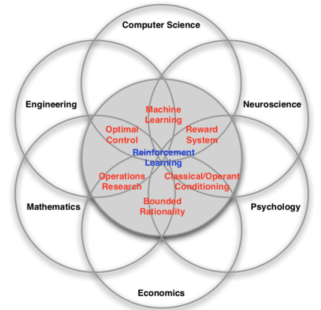
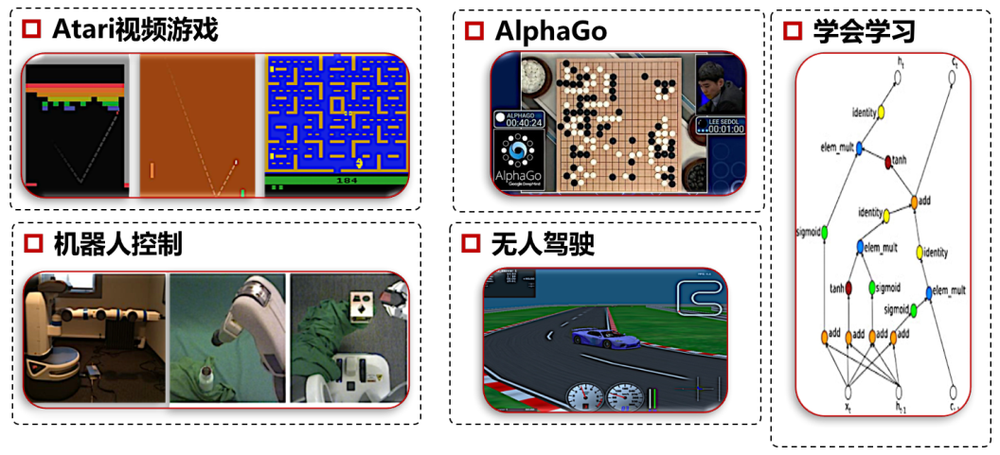
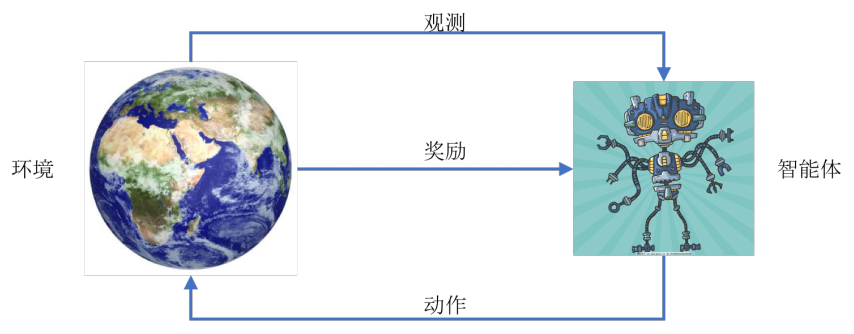
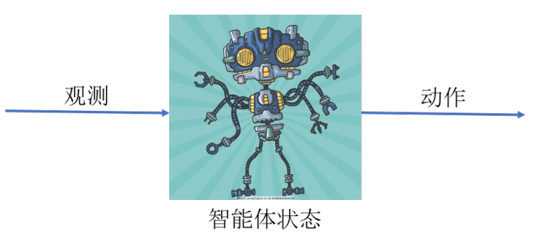
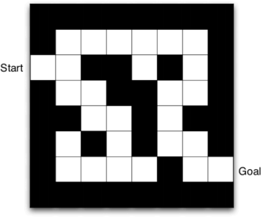
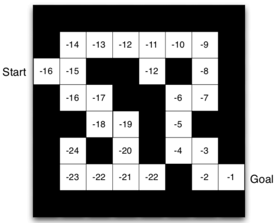
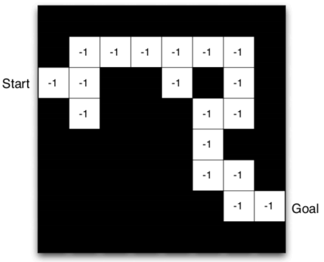

# 强化学习概论

* [返回顶层目录](../../SUMMARY.md#目录)
* [认识强化学习](#认识强化学习)
  * [什么是强化学习](#什么是强化学习)
  * [强化学习和其他机器学习的关系](#强化学习和其他机器学习的关系)
  * [强化学习的直观特性](#强化学习的直观特性)
  * [强化学习与监督学习和赌博机问题的关系](#强化学习与监督学习和赌博机问题的关系)
  * [强化学习例子](#强化学习例子)
* [强化学习的组成](#强化学习的组成)
  * [整体结构](#整体结构)
  * [奖励](#奖励)
    * [奖励假设](#奖励假设)
    * [奖励示例](#奖励示例)
    * [长期奖励](#长期奖励)
    * [奖励值与回报值](#奖励值与回报值)
  * [状态](#状态)
    * [历史和状态](#历史和状态)
    * [状态的例子](#状态的例子)
    * [环境状态](#环境状态)
    * [智能体状态](#智能体状态)
    * [环境状态和智能体状态对比](#环境状态和智能体状态对比)
    * [全观测和部分观测环境](#全观测和部分观测环境)
  * [动作](#动作)
* [智能体的组成](#智能体的组成)
  * [智能体的主要组成部分](#智能体的主要组成部分)
  * [策略](#策略)
  * [值函数](#值函数)
  * [模型](#模型)
  * [迷宫的例子](#迷宫的例子)
* [强化学习的分类](#强化学习的分类)
  * [按环境分类](#按环境分类)
  * [按智能体的成分分类](#按智能体的成分分类)
  * [按有无模型分类](#按有无模型分类)
  * [按使用的手段分类](#按使用的手段分类)
* [强化学习中的关键概念](#强化学习中的关键概念)
  * [学习与规划](#学习与规划)
  * [探索与利用](#探索与利用)
  * [评价和优化](#评价和优化)
* [项目实践](#项目实践)
  * [TicTacToe三子棋对抗游戏](#TicTacToe三子棋对抗游戏)
* [进一步思考](#进一步思考)

# 认识强化学习

## 什么是强化学习

* 面向智能体的学习——通过与一个环境进行交互来实现目标。
* 通过试错和优化进行学习——用试错后的奖励（或惩罚）进行学习。

## 强化学习和其他机器学习的关系

先看下强化学习和其他学科的关系：

再看强化学习和其他机器学习的关系：

我们知道，机器学习分为：

>- 监督学习（supervised learning）：有即时标签的学习（分类、回归等）
>- 非监督学习（unsupervised learning）：无标签学习（聚类问题）
>- 强化学习：有延迟奖励的学习问题，介于监督和非监督之间

* 监督学习本质上也可以认为是强化学习的一种特殊形式（无延迟场景）
* 强化学习更贴近人类的学习过程
* 强化学习可能是通往通用人工智能的道路

## 强化学习的直观特性

*  没有监督信号，只有奖励信号（具体vs抽象）
*  奖励信号大都是延迟的，不是瞬时的
*  问题是优化问题（怎么做最好）
*  数据具有时间相关性，不满足独立同分布假设
*  智能体的动作是可以影响它之后的数据

## 强化学习与监督学习和赌博机问题的关系

* 赌博机（bangit）问题：（非正式定义）搜单步优化问题，每一个时刻都有奖励，每次决策跟后续状态没有关系。一般认为赌博机问题不考虑状态。
* 赌博机问题和监督学习的区别是给标签还是给奖励。
* 当赌博机问题拓展到多步时会变成强化学习问题。

## 强化学习例子

* 无人机特技飞行
* 管理投资策略系统
* 控制电力系统
* 广告投放策略控制（阿里巴巴）

# 强化学习的组成

## 整体结构

每个时刻t，

* 智能体(agent)
  * 智能体执行动作$A_t$，并在环境中得到观测$Q_t$和奖励$R_t$
* 环境(encironment)
  * 环境会对智能体的动作$A_t$做出反应，然后发送新的观测$Q_{t+1}$和奖励$R_{t+1}$

我们要注意学会区分智能体和环境：

* 智能体是只讲话学习需要优化的部分，是我们能够精确控制的部分

* 环境是我们不能直接控制的部分

* **区分智能体和环境是强化学习的第一步**

* 环境并不是指自然环境

* 不同的问题，智能体和环境的划分也有所区别

  * 机器人探索房间vs机器人行走控制

    机器人探索房间，那智能体就是机器人的搜索策略，环境就是房间的环境。

    机器人行走控制，那智能体就是机器人的控制算法，环境就是机器人的身体状态。

  * 仿真环境中的控制vs实际环境中的控制

    仿真环境能把一个无人驾驶的汽车看成一个智能体，但是在实际环境中，并不能做到完美地控制汽车，所以只是把汽车中的控制代码看成一个智能体，其他（汽车本身和驾驶环境）看成环境。

## 奖励

* **奖励是强化学习的核心**
  * 可以没有观测，但是不能没有奖励
  * 奖励是强化学习区别其他机器学习的标志特征
* 奖励的特点
  * 奖励$R_t$是一个**标量**反馈
  * 它衡量了智能体在实践t上做的有多好
  * 智能体的目标就是**最大化累积奖励**

### 奖励假设

**强化学习的目标就是最大化期望累积奖励。**

注：如果一个问题不满足奖励假设，那么就不能用强化学习去解决！

### 奖励示例

* 无人机和无人车控制
  * +奖励：如果按预定轨迹运行
  * -奖励：碰撞或翻车
* 下围棋
  * +/-奖励：赢了/输了
* Atari游戏
  * +/-奖励：得分增加/减少
* 机械臂控制
  * +奖励：成功抓到东西

注：奖励并不要求一定要有正有负，只有正的奖励和负的奖励都可以！

### 长期奖励

* 每一个动作都可能有一个长期的结果
* 奖励可能是延迟的
* 有时我们需要牺牲一些短期奖励来获得更多的长期奖励
* 例子
  * 下围棋：只有在最后才能获得奖励
  * 打砖块游戏：当球运行一段到砖块时才有奖励
  * （牺牲短期奖励的例子）：平时考试抄袭虽然可以或的短暂的奖励，但是为了长期奖励（取得进步），我们需要牺牲短期奖励

### 奖励值与回报值

当智能体在时间t内做出动作$A_t$时，会在未来收到奖励序列$R_t, R_{t+1}, R_{t+2},...$。我们的目的是使**累积奖励**最大。一种通用的累积奖励的定义方式是将这些奖励值进行加权求和：
$$
G_t=w_tR_t+w_{t+1}R_{t+1}+w_{t+2}R_{t+2}+...
$$
其中$w_t$表示不同时间的加权系数

* 我们把上面的$G_t$值称为**回报值（Return）**
* 回报值衡量了动作$A_t$对未来结果的影响
* 强化学习的目的即变成了在每个时刻，使未来的**期望回报值**最大

**回报值**

* $w_{t+n}=1,\forall n$
  * 我们将所有时刻的奖励看成一样重要的
  * 这样的$G_t$是**无衰减回报值（undiscounted return）**
* $w_{t+n}=\gamma^n,\gamma\in[0,1]$
  * $G_t=R_t+\gamma R_{t+1}+\gamma^2 R_{t+2}+...$
  * $\gamma=0$时，退化成赌博机问题
  * $\gamma=1$时，编程无衰减回报值
  * $\gamma\in(0,1)$时，$\gamma$值衡量了我们对未来奖励的关注度，$\gamma$越大，表示我们越关注长期奖励，$\gamma$越小，表示我们越关注短期奖励
  * 这样的$G_t$是**衰减回报值（discounted return）**
  * $\gamma$被称为**衰减系数**。

**衰减系数的理解**

* 未来的奖励还会受到其他动作的影响
* 在估计未来奖励时，我们的把握也越来越小

## 状态

状态和观测不一样，观测是智能体和环境当前时刻直接的交互，而状态可能包含了好些观测，甚至整个历史。所以，状态是历史的函数，这个函数视具体问题而定。

### 历史和状态

* **历史（history）**是一个观测、动作和奖励的序列
  $$
  H_t=O_1,R_1,A_1,\ O_2,R_2,A_2,\ ...\ ,O_t,R_t,A_t
  $$

* 就是智能体在时间t以前的所有的交互变量

* 根据历史：

  * 智能体选择动作$A_t$
  * 环境产生新的观测$O_{t+1}$和奖励$R_{t+1}$

* **状态**是历史的一种表达，根据状态我们可以判断接下来发生什么

* 本质上，状态是历史的一个函数$S_t=f(H_t)$

### 状态的例子

* 下棋时，棋盘现在的布局可以被认为是状态$S_t=Q_t$

* 玩打砖块游戏时，前几帧的观测被认为是状态
  $$
  S_t=O_{t-3},O_{t-2},O_{t-1},O_t
  $$

* 玩CS时，可能整个历史都被认为是状态$S_t=H_t$

### 环境状态

* 环境状态$S^e_t$是环境的内部表达
* **所有能够影响环境产生观测/奖励的数据都被认为是环境状态的一部分**
* 环境状态一般是智能体观察不到的
* 即使环境状态$S_t^e$可见的，一般也包含了不相关的信息

### 智能体状态

* 智能体状态$S^a_t$是智能体的内部表达

* **所有能够影响智能体做出下一个动作的数据都被认为是智能体状态的一部分**

* 强化学习中使用的状态

* 智能体状态可能是历史的任何函数
  $$
  S_t^a=f(H_t)
  $$

### 环境状态和智能体状态对比

* 机器人控制
  * 环境状态：所有机械零件的参数、状态等
  * 智能体状态：传感器所获得的数据
* 3D游戏
  * 环境状态：所有的游戏参数以及对手信息
  * 智能体状态：玩家所能看到的观测

**要点**

* 对于智能体来说，环境状态是未知的，智能体状态是已知的
* 智能体通过智能体的状态做出相应的动作
* 没有特殊说明的情况下，我们所说的状态均指智能体状态$S_t=S_t^a$

### 全观测和部分观测环境

* 全观测
  * 智能体能够直接观测到环境状态$Q_t=S_t^a=S_t^e$
  * 或者说智能体状态**等价于**环境状态（注意不是相等，因为环境状态含有噪声）
  * 这是强化学习的主要研究问题（之后详述）——马尔科夫决策过程
* 部分观测
  * 智能体**不直接**观测到环境状态
  * 智能体状态$\neq$环境状态
  * 部分观测下的马尔科夫决策问题

## 动作

* 动作是智能体主动和环境交互的媒介

* 动作必须对环境起到一定的控制作用（尤其是对奖励）

  即动作序列$A_1,A_2,A_3,...$能够影响智能体的回报值

**要点**

* 动作要能改变未来所能获得的奖励
  * 打砖块时上/下动作不能改变环境
* 奖励的设置要能被动作改变
  * 比如时间的流逝是不受改变的

注：如果上述两点不满足，那么就无法解这个强化学习问题。

# 智能体的组成

## 智能体的主要组成部分

**智能体(agent)**是强化学习需要优化的部分。

一个强化学习的智能体主要由以下一个或几个部分组成：

* 策略（Policy）
* 值函数（value function）
* 模型（model）

注：这里只是描述，后续会对这几个部分详述。

## 策略

* 策略是智能体的核心，我们最终的目的就是找到一个策略
* 通过策略可以描述智能体的行为
* 它是一个从状态到动作的映射
* 直观上描述就是：当智能体在什么状态时应该做什么事
* 策略分两大类：
  * 确定性策略：$a=\pi(s)$
  * 随机性策略：$\pi(a|s)=P[A_t=a|S_t=s]$

## 值函数

* 值函数是对回报值的预测（期望）
* 值函数主要用来评价不同状态的好坏
* 可以用来指导动作的选择

$$
\text{v}_{\pi}(s)=\mathbb{E}[G_t|S_t=s]=\mathbb{E}[R_{t+1}+\gamma R_{t+2}+...|S_t=s]
$$

## 模型

* 这里的模型指智能体所拥有的对环境的预测模型，主要包含两部分：

  * P：预测下一个状态是什么

  * R：预测下一奖励是什么
    $$
    \begin{aligned}
    &P_{ss'}^{a}=\mathbb{P}[S_{t+1}=s'|S_t=s,A_t=a]\\
    &P_s^a=\mathbb{E}[R_{t+1}|S_t=s,A_t=a]
    \end{aligned}
    $$

* 这里我们将环境看成一个黑盒子，只关心其输入输出

* $P_{ss'}^a$是一个概率

  * 确定性环境
  * 随机性环境

* P和R可能是不精确的

## 迷宫的例子

**迷宫描述：**

* 奖励：每走一步获得-1的奖励
* 动作：上下左右
* 状态：智能体的位置

**迷宫策略：**

* 图中的箭头描述了$\pi(s)$——确定性策略

**迷宫值函数：**

* 图中的数字代表了$V_π(s)$——按照π进行的值函数

**迷宫模型：**

* 网格的布局即代表了$P_{ss'}^a$——确定性环境
* 数值代表了$R_s^a$

# 强化学习的分类

## 按环境分类

* 全观测环境下的强化学习
* 部分可观测环境下的强化学习

## 按智能体的成分分类

* 基于值函数：学习值函数
* 基于策略：学习策略
* Actor Critic：同时学习策略和值函数

## 按有无模型分类

* 无模型强化学习
* 基于模型的强化学习

## 按使用的手段分类

* 传统强化学习
* 深度强化学习

# 强化学习中的关键概念

## 学习与规划

对于序列决策问题有两个基本问题

* 强化学习
  * 环境未知
  * 智能体与环境进行交互
  * 智能体会不断改善自己的策略
* 规划（Planning）
  * 环境已知
  * 智能体可根据模型直接计算，不用交互
  * 智能体会不断地改善自己的策略

注：

* 既利用模型进行规划，又与环境交互进行强化学习，这就构成了基于模型的强化学习
* 当有很精确的环境模型时，可以直接用规划的方式解

## 探索与利用

* 探索（Exploration）和利用（Exploitation）是强化学习的**根本问题**
* 强化学习会根据过去的经验得到一个好的策略
* 但是还有没有更好的策略呢？
* **探索**是为了能够发现环境的更多信息
* **利用**是为了利用当前已知的信息来使回报值最大化
* 两者同等重要

## 评价和优化

在很多地方叫预测（Prediction）和控制（Control）

* 评价：给一个策略，评价该策略的好坏，即求对应的值函数
* 优化：找到最优的策略

这两个过程构成了强化学习的基本思路

# 项目实践

## TicTacToe三子棋对抗游戏

TicTacToe 是一个简单的对抗游戏，棋盘大小为3×3，谁先将棋盘连成线（横、竖、斜），谁就获得胜利。 (× 先手) 这里要求大家实现以下功能：

 (a) 用数值的方式表示状态、动作、奖励（+1/0/-1 区分胜/平/负）

(b) 环境类，环境能够根据智能体的动作给出反馈。即实现成员函数step(a)->s,r

(c) 智能体类，并包含一个随机策略，即从剩下的空位中随机采样一个位置下。函数形式 policy(s)->a

(d) 通过仿真的形式，大量对弈，统计在都执行随机策略的情况下，先手和后手胜利的概率。

注：主要希望大家从代码层面体会环境和智能体之间的关系，用编程函数的形式去实现数学函数 R, P, π。

参考：[三子棋简单实现](https://blog.csdn.net/adorable_/article/details/78387055)

https://github.com/zkan/tictactoe/blob/master/tictactoe_rl.py

https://github.com/gabrieledcjr/TicTacToe

https://github.com/gabrieledcjr/TicTacToe/blob/master/tictactoeRL.py

# 进一步思考

在使用强化学习方法解决问题的时候，最关键的一点就是能够定义强化学习问题。良好的强化学习定义是解决问题的先决条件。 选择你认为可以建模成强化学习的两个场景，并回答下面的问题 

(a) 为什么这个场景需要强化学习来建模？监督学习，赌博机问题建模可不可以？

(b) 在这个强化学习问题中，环境和智能体分别指什么？

(c) 如何定义状态、动作和奖励？思考定义的合理性

(d) 是全观测的还是部分观测的？为什么？

(e) 环境模型已知还是未知？

(f) 你所认为的最佳策略应该是确定性的还是随机性的？

# 参考资料

* [强化学习理论与实践-深蓝学院](http://www.shenlanxueyuan.com/course/96)

本文主要参考此课程的ppt。